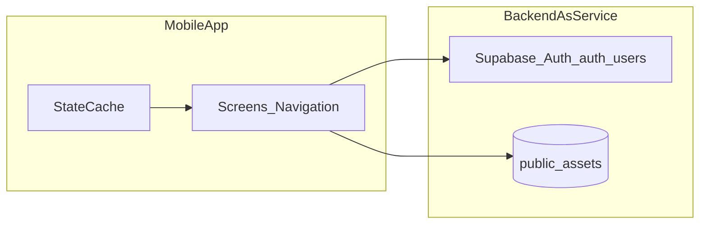

# InvestWatch MVP – Geliştirme Planı

Bu dosya, [README.md](README.md) ve [Yatirim-Takibi-MVP-PRD.md](Yatirim-Takibi-MVP-PRD.md) belgelerine dayanır. Ürün gereksinimlerinin tek kaynağı PRD'dir.

## Kaynak belgeler

- Ürün özeti ve doküman indeksi: `README.md`
- Ayrıntılı gereksinimler ve kabul kriterleri: `Yatirim-Takibi-MVP-PRD.md`
- Faz 6 kalite checklist: `FAZ6_KALITE_CHECKLIST.md`

**Not:** Depoda `PRD.md` adı kullanılmıyor; PRD içeriği `Yatirim-Takibi-MVP-PRD.md` dosyasında.

## MVP kapsamı (PRD ile hizalama)

**Kapsamda:** Login/Register, varlık ekleme (ad, tür, adet, alış fiyatı, güncel fiyat), dashboard'da toplam değer ve kâr/zarar, portföy detay, varlık dağılım grafiği (pasta veya sütun), varlık silme ve manuel fiyat güncelleme.

**Kapsam dışı:** Broker entegrasyonu, web sürümü, gelişmiş analiz, sosyal özellikler, gelişmiş bildirim motoru.

**US-5 ("zaman içinde performans"):** PRD bölüm 8'deki acceptance criteria yalnızca US-1–US-3'ü kapsar; MVP ekran listesinde tarihsel performans grafiği yok. Bu madde **MVP sonrası backlog** olarak tutulmalı; MVP'de anlık metrikler ve dağılım grafiği yeterlidir.

## Teknik mimari

**Kesinleşen stack:** Expo (React Native) + TypeScript + Expo Router + Supabase.

**Seçilen yaklaşım:** MVP için **Expo + TypeScript + Supabase**. Tek kod tabanıyla iOS/Android çıkışı, hızlı auth entegrasyonu ve PRD'deki `Asset` modelinin doğrudan tablo bazlı kurgulanması. NFR-3 (güvenli saklama) için sunucu tarafı RLS policy uygulanmıştır.

## Veri modeli ve iş kuralları (PRD §12)

### User (Supabase Auth)

Kullanıcı hesapları **`auth.users`** içinde Supabase Auth tarafından yönetilir. Uygulama tarafında ayrı bir `public.users` tablosu yoktur.

- `id`, `email`, `password_hash` (Auth tarafından), `created_at`

### Asset (`public.assets`)

- `id`, `user_id` (FK → `auth.users.id`), `name`, `type`, `quantity`, `buy_price`, `current_price`, `created_at`, `updated_at`
- `type` kısıtı: `Hisse`, `Kripto`, `Emtia`, `Fon`, `Döviz`
- `quantity > 0`, `name` boş olamaz (DB check constraint)

**Migration dosyaları:**

| Dosya | İçerik |
|-------|--------|
| `001_init_tracking_eye.sql` | Tablo, index, RLS (select/insert/update/delete own) |
| `002_add_updated_at_and_constraints.sql` | `updated_at` + moddatetime trigger, `type` check |
| `003_harden_assets_integrity_and_indexes.sql` | `quantity > 0`, boş `name` engeli, birleşik index, force RLS |

**Hesaplamalar (FR-4, FR-5):**

- Varlık piyasa değeri: `quantity * current_price`
- Varlık kâr/zarar (mutlak): `(current_price - buy_price) * quantity`
- Toplamlar: tüm varlıklar üzerinden toplama; toplam getiri yüzdesi: `((toplam_değer - toplam_maliyet) / toplam_maliyet) * 100` — toplam maliyet 0 ise `0` (UI koruma).

**Dağılım grafiği (FR-6):** Dilim ağırlığı `varlık_değeri / toplam_portföy_değeri`; toplam değer 0 ise boş durum ekranı.

## Ekranlar ve navigasyon (PRD §11)

| Ekran | PRD karşılığı | Ana işler |
|--------|----------------|-----------|
| Login / Register | FR-1 | Kayıt, giriş, oturum, anlaşılır hata mesajları |
| Dashboard | FR-7, US-2, US-3 (kısmen) | Toplam değer, kâr/zarar, dağılım grafiği, varlık ekleme / portföye geçiş |
| Varlık ekleme | US-1, FR-2 | Form, kayıt, başarı sonrası listelerin güncellenmesi |
| Portföy detay | FR-3, FR-5 | Varlık listesi, satır bazlı değer ve kâr/zarar |
| Varlık detay | FR-3 | Fiyat güncelleme, silme |

## Fazlara ayrılmış uygulama sırası

1. ~~Proje iskelesi: repo yapısı, lint/format, ortam değişkenleri, BaaS projesi ve şema.~~ ✅ **Tamamlandı**
2. ~~Kimlik doğrulama: Register/Login, çıkış, korumalı rotalar; boş portföy durumu.~~ ✅ **Tamamlandı**
3. ~~Varlık CRUD: PRD alanlarıyla ekleme, listeleme, silme, güncel fiyat güncelleme.~~ ✅ **Tamamlandı**
4. ~~Dashboard: toplamlar, kâr/zarar, dağılım grafiği, yükleme ve hata durumları (NFR-1).~~ ✅ **Tamamlandı**
5. ~~Portföy detay: liste ve satır metrikleri; dashboard ile aynı hesap kuralları.~~ ✅ **Tamamlandı**
6. Kalite: birim testler, manuel kabul, iOS/Android smoke, RLS doğrulaması (NFR-2, NFR-4). ✅ **Tamamlandı**
7. MVP sonrası: US-5 ve PRD §15 (otomatik fiyat, bildirimler, tarihsel performans). ✅ **Tamamlandı**

## Test ve kabul

- Manuel test: `FAZ6_KALITE_CHECKLIST.md` (PRD §8, auth smoke, CRUD smoke, platform smoke, DB kontrolü)
- Birim test: `npm run test` — `src/utils/portfolio.test.ts` (toplam, yüzde, dağılım)
- İsteğe bağlı: kimlik ve varlık API akışları için entegrasyon testi

### Kabul kriteri eşlemesi

| PRD senaryosu | Uygulamadaki karşılığı |
|---------------|-------------------------|
| US-1 Varlık ekleme | Kullanıcı giriş yaptıktan sonra varlık formunu kaydeder; kayıt sonrası dashboard ve portföy listesi güncellenir. |
| US-2 Portföy görüntüleme | Dashboard açıldığında toplam portföy değeri ve toplam kâr/zarar görünür. |
| US-3 Performans takibi | Dashboard veya portföy detay ekranında varlık dağılımı grafik olarak gösterilir. |

## Teslimat çıktıları

- iOS/Android için çalışan build (Expo EAS veya seçilen pipeline).
- Şema ve güvenlik kurallarının kısa teknik özeti (README'ye bağlantı yeterli olabilir).
- KPI (PRD §13) için temel olay günlüğü tasarımı; araç seçimi sonraya bırakılabilir.

## Riskler (PRD §14)

- Düzensiz manuel fiyat güncellemesi ürün alışkanlığını zayıflatır; "güncel fiyatı güncelle" akışı belirgin olmalıdır.
- Finans jargonu yeni kullanıcıyı zorlar; sade Türkçe etiketler ve kısa açıklamalar tercih edilmelidir.

## Yürütme kontrol listesi (backlog öğeleri)

- [x] Cross-platform çerçeve (Expo RN) ve BaaS (Supabase) seçimini netleştir; repo iskelesi ve ortam değişkenlerini kur.
- [x] PRD Asset modeline uygun veritabanı şeması ve kullanıcıya özel erişim (RLS/policy) tasarla ve uygula.
- [x] Login/Register akışı, oturum yönetimi ve korumalı navigasyon (FR-1).
- [x] Varlık ekleme, listeleme, silme ve güncel fiyat güncelleme (FR-2, FR-3).
- [x] Dashboard: toplam değer, toplam kâr/zarar, dağılım grafiği, boş/yükleme/hata (FR-4–FR-7, NFR-1/2/4).
- [x] Portföy detay ekranı: varlık bazlı metrikler, dashboard ile tutarlı hesaplar.
- [x] Portföy hesaplama birim testleri (Vitest).
- [x] PRD §8 manuel kabul testleri; iOS/Android smoke; RLS smoke doğrulaması.
- [x] US-5 ve PRD §15 maddeleri (otomatik fiyat, bildirimler, tarihsel performans) başarıyla geliştirildi.
