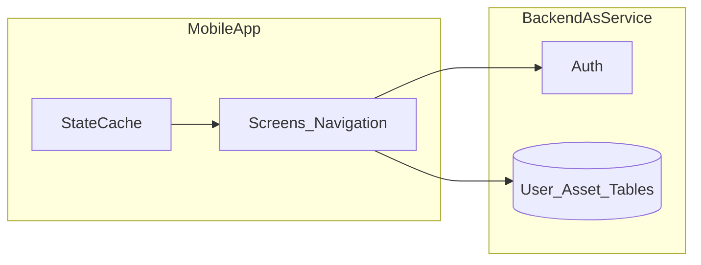

# TrackingEye MVP – Geliştirme Planı

Bu dosya, [README.md](README.md) ve [Yatirim-Takibi-MVP-PRD.md](Yatirim-Takibi-MVP-PRD.md) belgelerine dayanır. Ürün gereksinimlerinin tek kaynağı PRD’dir; uygulama kodu bu plandan bağımsız olarak, onay sonrası ayrı bir geliştirme turunda ele alınmalıdır.

## Kaynak belgeler

- Ürün özeti ve doküman indeksi: `README.md`
- Ayrıntılı gereksinimler ve kabul kriterleri: `Yatirim-Takibi-MVP-PRD.md`

**Not:** Depoda `PRD.md` adı kullanılmıyor; PRD içeriği `Yatirim-Takibi-MVP-PRD.md` dosyasında. İstenirse ileride `PRD.md` yalnızca yönlendirme (kısa link) olarak eklenebilir.

## MVP kapsamı (PRD ile hizalama)

**Kapsamda:** Login/Register, varlık ekleme (ad, tür, adet, alış fiyatı, güncel fiyat), dashboard’da toplam değer ve kâr/zarar, portföy detay, varlık dağılım grafiği (pasta veya sütun).

**Kapsam dışı:** Broker entegrasyonu, web sürümü, gelişmiş analiz, sosyal özellikler, gelişmiş bildirim motoru.

**US-5 (“zaman içinde performans”):** PRD bölüm 8’deki acceptance criteria yalnızca US-1–US-3’ü kapsar; MVP ekran listesinde tarihsel performans grafiği yok. Bu madde **MVP sonrası backlog** olarak tutulmalı; MVP’de anlık metrikler ve dağılım grafiği yeterlidir.

## Önerilen teknik mimari

İlk sprintte stack seçimi netleştirilmelidir.

**Seçenek A (hızlı MVP):** Expo (React Native) + TypeScript, Expo Router, form doğrulama (ör. Zod), grafik (ör. Victory Native veya react-native-chart-kit), backend olarak **Supabase** veya **Firebase** (kimlik doğrulama + veritabanı, satır bazlı güvenlik kuralları / RLS).

**Seçenek B:** Flutter + Dart ve benzeri BaaS veya ince bir REST API.

**Öneri:** MVP için **Expo + TypeScript + Supabase** (alternatif: Firebase). Bu kombinasyon; tek kod tabanıyla iOS/Android çıkışı, hızlı auth entegrasyonu ve PRD’deki `User` / `Asset` modelini doğrudan tablo bazlı kurgulama avantajı sağlar. NFR-3 (güvenli saklama) için sunucu tarafı RLS veya eşdeğeri policy uygulanmalıdır.

## Veri modeli ve iş kuralları (PRD §12)

- **User:** `id`, `email`, `password_hash` (BaaS kullanılıyorsa parola hash’i sağlayıcı tarafından yönetilir), `created_at`.
- **Asset:** `user_id`, `name`, `type`, `quantity`, `buy_price`, `current_price`, `created_at`.

**Hesaplamalar (FR-4, FR-5):**

- Varlık piyasa değeri: `quantity * current_price`
- Varlık kâr/zarar (mutlak): `(current_price - buy_price) * quantity`
- Toplamlar: tüm varlıklar üzerinden toplama; toplam getiri yüzdesi: `((toplam_değer - toplam_maliyet) / toplam_maliyet) * 100` — toplam maliyet 0 ise UI’da “—” veya koruma.

**Dağılım grafiği (FR-6):** Dilim ağırlığı `varlık_değeri / toplam_portföy_değeri`; toplam değer 0 ise boş durum ekranı.

## Ekranlar ve navigasyon (PRD §11)

| Ekran | PRD karşılığı | Ana işler |
|--------|----------------|-----------|
| Login / Register | FR-1 | Kayıt, giriş, oturum, anlaşılır hata mesajları |
| Dashboard | FR-7, US-2, US-3 (kısmen) | Toplam değer, kâr/zarar, dağılım grafiği, varlık ekleme / portföye geçiş |
| Varlık ekleme | US-1, FR-2 | Form, kayıt, başarı sonrası listelerin güncellenmesi |
| Portföy detay | FR-3, FR-5 | Varlık listesi, satır bazlı değer ve kâr/zarar |

**MVP tamamlayıcı ürün kararı:** Broker olmadığı için kullanıcının takılı kalmaması adına **varlık silme** ve **güncel fiyatı manuel güncelleme** (ve gerekirse düzenleme) eklenmesi önerilir.

## Fazlara ayrılmış uygulama sırası

1. Proje iskelesi: repo yapısı, lint/format, ortam değişkenleri, BaaS projesi ve şema (`assets` tablosu; kullanıcı kimliği `auth.users` veya eşdeğeri ile ilişki).
2. Kimlik doğrulama: Register/Login, çıkış, korumalı rotalar; boş portföy durumu.
3. Varlık CRUD: PRD alanlarıyla ekleme, listeleme, silme, güncel fiyat güncelleme.
4. Dashboard: toplamlar, kâr/zarar, dağılım grafiği, yükleme ve hata durumları (NFR-1).
5. Portföy detay: liste ve satır metrikleri; dashboard ile aynı hesap kuralları.
6. Kalite: iOS/Android smoke, RLS/policy doğrulaması, sade ve tutarlı arayüz (NFR-2, NFR-4).
7. MVP sonrası: US-5 ve PRD §15 (otomatik fiyat, bildirimler, tarihsel performans).

## Test ve kabul

- PRD §8 acceptance senaryolarına göre manuel test kontrol listesi.
- Birim test: portföy hesaplama yardımcıları (toplam, yüzde, dağılım).
- İsteğe bağlı: kimlik ve varlık API akışları için entegrasyon testi.

### Kabul kriteri eşlemesi

| PRD senaryosu | Uygulamadaki karşılığı |
|---------------|-------------------------|
| US-1 Varlık ekleme | Kullanıcı giriş yaptıktan sonra varlık formunu kaydeder; kayıt sonrası dashboard ve portföy listesi güncellenir. |
| US-2 Portföy görüntüleme | Dashboard açıldığında toplam portföy değeri ve toplam kâr/zarar görünür. |
| US-3 Performans takibi | Dashboard veya portföy detay ekranında varlık dağılımı grafik olarak gösterilir. |

## Teslimat çıktıları

- iOS/Android için çalışan build (Expo EAS veya seçilen pipeline).
- Şema ve güvenlik kurallarının kısa teknik özeti (README’ye bağlantı yeterli olabilir).
- KPI (PRD §13) için temel olay günlüğü tasarımı; araç seçimi sonraya bırakılabilir.

## Riskler (PRD §14)

- Düzensiz manuel fiyat güncellemesi ürün alışkanlığını zayıflatır; “güncel fiyatı güncelle” akışı belirgin olmalıdır.
- Finans jargonu yeni kullanıcıyı zorlar; sade Türkçe etiketler ve kısa açıklamalar tercih edilmelidir.

## Yürütme kontrol listesi (backlog öğeleri)

Aşağıdaki maddeler geliştirme sırasında iş takibi (issue/todo) olarak kullanılabilir. Sıra, önerilen uygulama fazlarıyla uyumludur.

- [ ] Cross-platform çerçeve (Expo RN veya Flutter) ve BaaS (Supabase/Firebase) seçimini netleştir; repo iskelesi ve ortam değişkenlerini kur.
- [ ] PRD User/Asset modeline uygun veritabanı şeması ve kullanıcıya özel erişim (RLS/policy) tasarla ve uygula.
- [ ] Login/Register akışı, oturum yönetimi ve korumalı navigasyon (FR-1).
- [ ] Varlık ekleme, listeleme, silme ve güncel fiyat güncelleme (FR-2, FR-3).
- [ ] Dashboard: toplam değer, toplam kâr/zarar, dağılım grafiği, boş/yükleme/hata (FR-4–FR-7, NFR-1/2/4).
- [ ] Portföy detay ekranı: varlık bazlı metrikler, dashboard ile tutarlı hesaplar.
- [ ] PRD §8 kabul testleri; hesaplama birim testleri; iOS/Android smoke.
- [ ] US-5 ve PRD §15 maddelerini MVP sonrası backlog’a taşı (market data, bildirimler, tarihsel performans).
